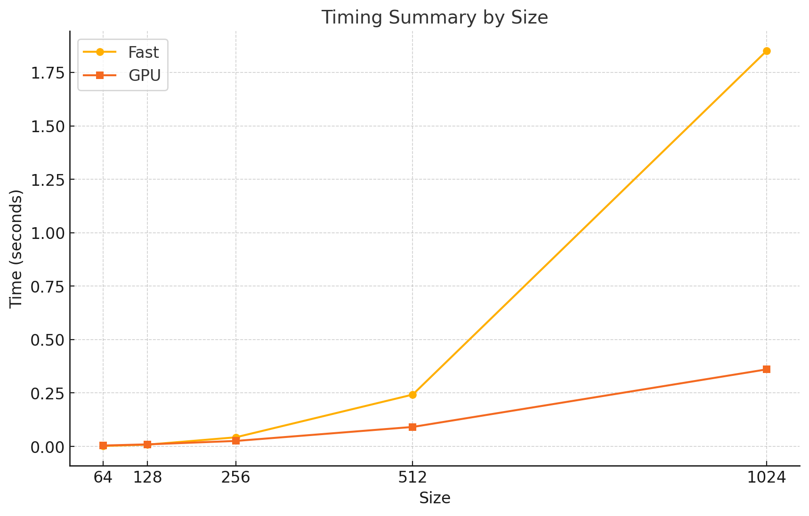

# MiniTorch Module 3


* Docs: https://minitorch.github.io/

* Overview: https://minitorch.github.io/module3.html


You will need to modify `tensor_functions.py` slightly in this assignment.

* Tests:

```
python run_tests.py
```

* Note:

Several of the tests for this assignment will only run if you are on a GPU machine and will not
run on github's test infrastructure. Please follow the instructions to setup up a colab machine
to run these tests.

This assignment requires the following files from the previous assignments. You can get these by running

```bash
python sync_previous_module.py previous-module-dir current-module-dir
```

The files that will be synced are:

        minitorch/tensor_data.py minitorch/tensor_functions.py minitorch/tensor_ops.py minitorch/operators.py minitorch/scalar.py minitorch/scalar_functions.py minitorch/module.py minitorch/autodiff.py minitorch/module.py project/run_manual.py project/run_scalar.py project/run_tensor.py minitorch/operators.py minitorch/module.py minitorch/autodiff.py minitorch/tensor.py minitorch/datasets.py minitorch/testing.py minitorch/optim.py


## Diagnostic output (task 3.1 and 3.2)

Output of `python project/parallel_check.py`:

```
MAP

================================================================================
 Parallel Accelerator Optimizing:  Function tensor_map.<locals>._map,
/home/arsem/Developer/mod3-eminalparslan/minitorch/fast_ops.py (164)
================================================================================


Parallel loop listing for  Function tensor_map.<locals>._map, /home/arsem/Developer/mod3-eminalparslan/minitorch/fast_ops.py (164)
-------------------------------------------------------------------------------------|loop #ID
    def _map(                                                                        |
        out: Storage,                                                                |
        out_shape: Shape,                                                            |
        out_strides: Strides,                                                        |
        in_storage: Storage,                                                         |
        in_shape: Shape,                                                             |
        in_strides: Strides,                                                         |
    ) -> None:                                                                       |
        # Special case when the tensors are stride-aligned                           |
        if len(out_shape) == len(in_shape) and (out_strides == in_strides).all():----| #0
            for i in prange(len(out)):-----------------------------------------------| #1
                out[i] = fn(in_storage[i])                                           |
            return                                                                   |
                                                                                     |
        # General case - use indices                                                 |
        for i in prange(len(out)):---------------------------------------------------| #2
            out_index: Index = np.empty(MAX_DIMS, dtype=np.int32)                    |
            in_index: Index = np.empty(MAX_DIMS, dtype=np.int32)                     |
            to_index(i, out_shape, out_index)                                        |
            broadcast_index(out_index, out_shape, in_shape, in_index)                |
            out_position = index_to_position(out_index, out_strides)                 |
            in_position = index_to_position(in_index, in_strides)                    |
            out[out_position] = fn(in_storage[in_position])                          |
--------------------------------- Fusing loops ---------------------------------
Attempting fusion of parallel loops (combines loops with similar properties)...
Following the attempted fusion of parallel for-loops there are 3 parallel for-
loop(s) (originating from loops labelled: #0, #1, #2).
--------------------------------------------------------------------------------
----------------------------- Before Optimisation ------------------------------
--------------------------------------------------------------------------------
------------------------------ After Optimisation ------------------------------
Parallel structure is already optimal.
--------------------------------------------------------------------------------
--------------------------------------------------------------------------------

---------------------------Loop invariant code motion---------------------------
Allocation hoisting:
The memory allocation derived from the instruction at
/home/arsem/Developer/mod3-eminalparslan/minitorch/fast_ops.py (180) is hoisted
out of the parallel loop labelled #2 (it will be performed before the loop is
executed and reused inside the loop):
   Allocation:: out_index: Index = np.empty(MAX_DIMS, dtype=np.int32)
    - numpy.empty() is used for the allocation.
The memory allocation derived from the instruction at
/home/arsem/Developer/mod3-eminalparslan/minitorch/fast_ops.py (181) is hoisted
out of the parallel loop labelled #2 (it will be performed before the loop is
executed and reused inside the loop):
   Allocation:: in_index: Index = np.empty(MAX_DIMS, dtype=np.int32)
    - numpy.empty() is used for the allocation.
None
ZIP

================================================================================
 Parallel Accelerator Optimizing:  Function tensor_zip.<locals>._zip,
/home/arsem/Developer/mod3-eminalparslan/minitorch/fast_ops.py (214)
================================================================================


Parallel loop listing for  Function tensor_zip.<locals>._zip, /home/arsem/Developer/mod3-eminalparslan/minitorch/fast_ops.py (214)
------------------------------------------------------------------------------------|loop #ID
    def _zip(                                                                       |
        out: Storage,                                                               |
        out_shape: Shape,                                                           |
        out_strides: Strides,                                                       |
        a_storage: Storage,                                                         |
        a_shape: Shape,                                                             |
        a_strides: Strides,                                                         |
        b_storage: Storage,                                                         |
        b_shape: Shape,                                                             |
        b_strides: Strides,                                                         |
    ) -> None:                                                                      |
        # Special case when the tensors are stride-aligned                          |
        if (                                                                        |
            len(out_shape) == len(a_shape)                                          |
            and (out_strides == a_strides).all()------------------------------------| #3
            and len(out_shape) == len(b_shape)                                      |
            and (out_strides == b_strides).all()------------------------------------| #4
            and (out_shape == a_shape).all()----------------------------------------| #5
            and (out_shape == b_shape).all()----------------------------------------| #6
        ):                                                                          |
            for i in prange(len(out)):----------------------------------------------| #7
                out[i] = fn(a_storage[i], b_storage[i])                             |
            return                                                                  |
                                                                                    |
        # General case                                                              |
        for i in prange(len(out)):--------------------------------------------------| #8
            # Need separate index buffers per thread                                |
            out_index = np.empty(MAX_DIMS, dtype=np.int32)                          |
            a_index = np.empty(MAX_DIMS, dtype=np.int32)                            |
            b_index = np.empty(MAX_DIMS, dtype=np.int32)                            |
                                                                                    |
            to_index(i, out_shape, out_index)                                       |
            broadcast_index(out_index, out_shape, a_shape, a_index)                 |
            broadcast_index(out_index, out_shape, b_shape, b_index)                 |
                                                                                    |
            out_position = index_to_position(out_index, out_strides)                |
            a_position = index_to_position(a_index, a_strides)                      |
            b_position = index_to_position(b_index, b_strides)                      |
                                                                                    |
            out[out_position] = fn(a_storage[a_position], b_storage[b_position])    |
--------------------------------- Fusing loops ---------------------------------
Attempting fusion of parallel loops (combines loops with similar properties)...
Following the attempted fusion of parallel for-loops there are 6 parallel for-
loop(s) (originating from loops labelled: #3, #4, #5, #6, #7, #8).
--------------------------------------------------------------------------------
----------------------------- Before Optimisation ------------------------------
--------------------------------------------------------------------------------
------------------------------ After Optimisation ------------------------------
Parallel structure is already optimal.
--------------------------------------------------------------------------------
--------------------------------------------------------------------------------

---------------------------Loop invariant code motion---------------------------
Allocation hoisting:
The memory allocation derived from the instruction at
/home/arsem/Developer/mod3-eminalparslan/minitorch/fast_ops.py (241) is hoisted
out of the parallel loop labelled #8 (it will be performed before the loop is
executed and reused inside the loop):
   Allocation:: out_index = np.empty(MAX_DIMS, dtype=np.int32)
    - numpy.empty() is used for the allocation.
The memory allocation derived from the instruction at
/home/arsem/Developer/mod3-eminalparslan/minitorch/fast_ops.py (242) is hoisted
out of the parallel loop labelled #8 (it will be performed before the loop is
executed and reused inside the loop):
   Allocation:: a_index = np.empty(MAX_DIMS, dtype=np.int32)
    - numpy.empty() is used for the allocation.
The memory allocation derived from the instruction at
/home/arsem/Developer/mod3-eminalparslan/minitorch/fast_ops.py (243) is hoisted
out of the parallel loop labelled #8 (it will be performed before the loop is
executed and reused inside the loop):
   Allocation:: b_index = np.empty(MAX_DIMS, dtype=np.int32)
    - numpy.empty() is used for the allocation.
None
REDUCE

================================================================================
 Parallel Accelerator Optimizing:  Function tensor_reduce.<locals>._reduce,
/home/arsem/Developer/mod3-eminalparslan/minitorch/fast_ops.py (279)
================================================================================


Parallel loop listing for  Function tensor_reduce.<locals>._reduce, /home/arsem/Developer/mod3-eminalparslan/minitorch/fast_ops.py (279)
------------------------------------------------------------------------------|loop #ID
    def _reduce(                                                              |
        out: Storage,                                                         |
        out_shape: Shape,                                                     |
        out_strides: Strides,                                                 |
        a_storage: Storage,                                                   |
        a_shape: Shape,                                                       |
        a_strides: Strides,                                                   |
        reduce_dim: int,                                                      |
    ) -> None:                                                                |
        for i in prange(len(out)):--------------------------------------------| #9
            out_index: Index = np.empty(MAX_DIMS, dtype=np.int32)             |
            base_index: Index = np.empty(MAX_DIMS, dtype=np.int32)            |
                                                                              |
            to_index(i, out_shape, out_index)                                 |
            out_position = index_to_position(out_index, out_strides)          |
                                                                              |
            broadcast_index(out_index, out_shape, a_shape, base_index)        |
            base_position = index_to_position(base_index, a_strides)          |
            reduced = a_storage[base_position]                                |
                                                                              |
            for offset in range(1, a_shape[reduce_dim]):                      |
                base_index[reduce_dim] = offset                               |
                # next_position = index_to_position(base_index, a_strides)    |
                next_position = 0                                             |
                for idx, stride in zip(base_index, a_strides):                |
                    next_position += idx * stride                             |
                reduced = fn(reduced, a_storage[next_position])               |
                                                                              |
            out[out_position] = reduced                                       |
--------------------------------- Fusing loops ---------------------------------
Attempting fusion of parallel loops (combines loops with similar properties)...
Following the attempted fusion of parallel for-loops there are 1 parallel for-
loop(s) (originating from loops labelled: #9).
--------------------------------------------------------------------------------
----------------------------- Before Optimisation ------------------------------
--------------------------------------------------------------------------------
------------------------------ After Optimisation ------------------------------
Parallel structure is already optimal.
--------------------------------------------------------------------------------
--------------------------------------------------------------------------------

---------------------------Loop invariant code motion---------------------------
Allocation hoisting:
The memory allocation derived from the instruction at
/home/arsem/Developer/mod3-eminalparslan/minitorch/fast_ops.py (289) is hoisted
out of the parallel loop labelled #9 (it will be performed before the loop is
executed and reused inside the loop):
   Allocation:: out_index: Index = np.empty(MAX_DIMS, dtype=np.int32)
    - numpy.empty() is used for the allocation.
The memory allocation derived from the instruction at
/home/arsem/Developer/mod3-eminalparslan/minitorch/fast_ops.py (290) is hoisted
out of the parallel loop labelled #9 (it will be performed before the loop is
executed and reused inside the loop):
   Allocation:: base_index: Index = np.empty(MAX_DIMS, dtype=np.int32)
    - numpy.empty() is used for the allocation.
None
MATRIX MULTIPLY

================================================================================
 Parallel Accelerator Optimizing:  Function _tensor_matrix_multiply,
/home/arsem/Developer/mod3-eminalparslan/minitorch/fast_ops.py (312)
================================================================================


Parallel loop listing for  Function _tensor_matrix_multiply, /home/arsem/Developer/mod3-eminalparslan/minitorch/fast_ops.py (312)
-------------------------------------------------------------------------------------|loop #ID
def _tensor_matrix_multiply(                                                         |
    out: Storage,                                                                    |
    out_shape: Shape,                                                                |
    out_strides: Strides,                                                            |
    a_storage: Storage,                                                              |
    a_shape: Shape,                                                                  |
    a_strides: Strides,                                                              |
    b_storage: Storage,                                                              |
    b_shape: Shape,                                                                  |
    b_strides: Strides,                                                              |
) -> None:                                                                           |
    """NUMBA tensor matrix multiply function.                                        |
                                                                                     |
    Should work for any tensor shapes that broadcast as long as                      |
                                                                                     |
    ```                                                                              |
    assert a_shape[-1] == b_shape[-2]                                                |
    ```                                                                              |
                                                                                     |
    Optimizations:                                                                   |
                                                                                     |
    * Outer loop in parallel                                                         |
    * No index buffers or function calls                                             |
    * Inner loop should have no global writes, 1 multiply.                           |
                                                                                     |
                                                                                     |
    Args:                                                                            |
    ----                                                                             |
        out (Storage): storage for `out` tensor                                      |
        out_shape (Shape): shape for `out` tensor                                    |
        out_strides (Strides): strides for `out` tensor                              |
        a_storage (Storage): storage for `a` tensor                                  |
        a_shape (Shape): shape for `a` tensor                                        |
        a_strides (Strides): strides for `a` tensor                                  |
        b_storage (Storage): storage for `b` tensor                                  |
        b_shape (Shape): shape for `b` tensor                                        |
        b_strides (Strides): strides for `b` tensor                                  |
                                                                                     |
    Returns:                                                                         |
    -------                                                                          |
        None : Fills in `out`                                                        |
                                                                                     |
    """                                                                              |
    a_batch_stride = a_strides[0] if a_shape[0] > 1 else 0                           |
    b_batch_stride = b_strides[0] if b_shape[0] > 1 else 0                           |
                                                                                     |
    for n in prange(out_shape[0]):---------------------------------------------------| #10
        # Position offset for batch dimension                                        |
        a_batch_pos = n * a_batch_stride                                             |
        b_batch_pos = n * b_batch_stride                                             |
        out_batch_pos = n * out_strides[0]                                           |
                                                                                     |
        for i in range(out_shape[1]):                                                |
            for j in range(out_shape[2]):                                            |
                out_pos = out_batch_pos + i * out_strides[1] + j * out_strides[2]    |
                                                                                     |
                acc = 0.0                                                            |
                                                                                     |
                # Inner dot product loop                                             |
                for k in range(a_shape[2]):                                          |
                    a_pos = a_batch_pos + i * a_strides[1] + k * a_strides[2]        |
                    b_pos = b_batch_pos + k * b_strides[1] + j * b_strides[2]        |
                    acc += a_storage[a_pos] * b_storage[b_pos]                       |
                                                                                     |
                out[out_pos] = acc                                                   |
--------------------------------- Fusing loops ---------------------------------
Attempting fusion of parallel loops (combines loops with similar properties)...
Following the attempted fusion of parallel for-loops there are 1 parallel for-
loop(s) (originating from loops labelled: #10).
--------------------------------------------------------------------------------
----------------------------- Before Optimisation ------------------------------
--------------------------------------------------------------------------------
------------------------------ After Optimisation ------------------------------
Parallel structure is already optimal.
--------------------------------------------------------------------------------
--------------------------------------------------------------------------------

---------------------------Loop invariant code motion---------------------------
Allocation hoisting:
No allocation hoisting found
None
```

# CPU vs GPU runtime graph




NOTE: these results were run locally on a machine with an RTX 3090.

## GPU split dataset

`0.95 seconds per epoch`

```
Epoch  0  loss  9.504313598705075 correct 21
Epoch  10  loss  6.489524557314567 correct 45
Epoch  20  loss  4.589078540078455 correct 47
Epoch  30  loss  4.285641812137768 correct 48
Epoch  40  loss  3.530826218560806 correct 47
Epoch  50  loss  3.2526292024311525 correct 48
Epoch  60  loss  1.2443844241636957 correct 48
Epoch  70  loss  2.2002247328191653 correct 49
Epoch  80  loss  0.9006055081096622 correct 50
Epoch  90  loss  1.0179344423043324 correct 50
Epoch  100  loss  0.7177427727707903 correct 50
Epoch  110  loss  0.5546105418660455 correct 50
Epoch  120  loss  1.5572314488777614 correct 48
Epoch  130  loss  0.9811494197585797 correct 50
Epoch  140  loss  1.2583576674977823 correct 49
Epoch  150  loss  1.5368266751651034 correct 49
Epoch  160  loss  0.1881530543134911 correct 50
Epoch  170  loss  0.13661156631015015 correct 50
Epoch  180  loss  0.18653232549308157 correct 49
Epoch  190  loss  0.13748709151967253 correct 50
Epoch  200  loss  0.3706482781417363 correct 50
Epoch  210  loss  0.1007119714120638 correct 50
Epoch  220  loss  1.2696919658321124 correct 50
Epoch  230  loss  0.9147207653895663 correct 50
Epoch  240  loss  0.7661491330527638 correct 50
Epoch  250  loss  0.47805570587319424 correct 50
Epoch  260  loss  0.08874523868974907 correct 50
Epoch  270  loss  0.7202065309386522 correct 49
Epoch  280  loss  0.2955681263252674 correct 50
Epoch  290  loss  0.18117588705735282 correct 50
Epoch  300  loss  0.8566243821380035 correct 50
Epoch  310  loss  0.8977984973286297 correct 50
Epoch  320  loss  0.6654028452313462 correct 50
Epoch  330  loss  0.5028732370444542 correct 50
Epoch  340  loss  0.18122023227409248 correct 50
Epoch  350  loss  0.13416175068958866 correct 50
Epoch  360  loss  0.21579988127197614 correct 50
Epoch  370  loss  0.008705974800524489 correct 50
Epoch  380  loss  0.7695760923467846 correct 50
Epoch  390  loss  0.14197214898871047 correct 50
Epoch  400  loss  0.6167810831705359 correct 50
Epoch  410  loss  0.1889785472487602 correct 50
Epoch  420  loss  0.7550902657172536 correct 49
Epoch  430  loss  0.12196322406851628 correct 50
Epoch  440  loss  0.17139093825806917 correct 50
Epoch  450  loss  0.28899019910028106 correct 50
Epoch  460  loss  0.2811713920809197 correct 50
Epoch  470  loss  0.0872417545746527 correct 50
Epoch  480  loss  0.03291555060782668 correct 50
Epoch  490  loss  0.0766025967578635 correct 50
```

## CPU split dataset

`0.08 seconds per epoch`

```
Epoch  0  loss  7.22441124259214 correct 25
Epoch  10  loss  5.216227849907209 correct 36
Epoch  20  loss  5.447503678718904 correct 36
Epoch  30  loss  4.367174281080985 correct 47
Epoch  40  loss  2.854977845176198 correct 47
Epoch  50  loss  4.734403985943378 correct 45
Epoch  60  loss  2.1366861890506184 correct 50
Epoch  70  loss  2.2363108012241617 correct 49
Epoch  80  loss  1.0761777926619887 correct 50
Epoch  90  loss  0.8150570211480168 correct 49
Epoch  100  loss  2.1104882181064455 correct 50
Epoch  110  loss  0.4014755285625409 correct 49
Epoch  120  loss  1.1984210256718253 correct 50
Epoch  130  loss  0.24213750054780314 correct 50
Epoch  140  loss  1.0316355952000515 correct 50
Epoch  150  loss  0.9441673548526209 correct 49
Epoch  160  loss  1.2044479482602748 correct 50
Epoch  170  loss  0.5627675959206335 correct 50
Epoch  180  loss  0.6099613716023395 correct 50
Epoch  190  loss  0.4621917913564768 correct 49
Epoch  200  loss  1.1317938470299473 correct 50
Epoch  210  loss  1.3842796308160248 correct 50
Epoch  220  loss  1.4203060178729263 correct 50
Epoch  230  loss  0.11143262172233083 correct 50
Epoch  240  loss  1.086053092727074 correct 50
Epoch  250  loss  0.48139270956266617 correct 50
Epoch  260  loss  0.27762914993820303 correct 50
Epoch  270  loss  0.6577812089297695 correct 50
Epoch  280  loss  1.4348578988316862 correct 49
Epoch  290  loss  0.27722533799581783 correct 50
Epoch  300  loss  0.5672522742900593 correct 50
Epoch  310  loss  0.5376979984630803 correct 50
Epoch  320  loss  0.2704519909261439 correct 50
Epoch  330  loss  0.5627750452876139 correct 50
Epoch  340  loss  0.9329850125734973 correct 50
Epoch  350  loss  0.39617984231158987 correct 50
Epoch  360  loss  0.5347636383878085 correct 50
Epoch  370  loss  0.3609720051106078 correct 50
Epoch  380  loss  0.3772665873661436 correct 50
Epoch  390  loss  0.4980787047616259 correct 50
Epoch  400  loss  0.03599522569558118 correct 50
Epoch  410  loss  0.47953725283774806 correct 50
Epoch  420  loss  0.7492445944172791 correct 50
Epoch  430  loss  1.008298313963013 correct 50
Epoch  440  loss  0.5666121367954546 correct 50
Epoch  450  loss  0.4772687945970014 correct 50
Epoch  460  loss  0.22205304408196044 correct 50
Epoch  470  loss  0.04145130919811497 correct 50
Epoch  480  loss  0.2887082593358735 correct 50
Epoch  490  loss  0.9648113040859561 correct 50
```

## GPU simple dataset

`0.93 seconds per epoch`

```
Epoch  0  loss  4.739046420918326 correct 39
Epoch  10  loss  1.354000076342702 correct 47
Epoch  20  loss  0.730408976816362 correct 48
Epoch  30  loss  1.1258831259207507 correct 50
Epoch  40  loss  1.616037796339823 correct 48
Epoch  50  loss  1.2292646822479816 correct 50
Epoch  60  loss  1.1436647268117317 correct 50
Epoch  70  loss  0.945252812613907 correct 47
Epoch  80  loss  0.278796343054008 correct 50
Epoch  90  loss  0.8490556377883948 correct 50
Epoch  100  loss  0.3016386039069537 correct 50
Epoch  110  loss  0.11512453183345785 correct 50
Epoch  120  loss  0.11349244727376301 correct 48
Epoch  130  loss  0.9210846727548533 correct 50
Epoch  140  loss  0.07162446469166456 correct 50
Epoch  150  loss  0.8720846291533229 correct 50
Epoch  160  loss  0.12970836532285027 correct 50
Epoch  170  loss  0.4994087203241932 correct 50
Epoch  180  loss  1.493528543956104 correct 50
Epoch  190  loss  0.7108414310290079 correct 50
Epoch  200  loss  0.44813713571207514 correct 50
Epoch  210  loss  0.5417194064796815 correct 50
Epoch  220  loss  0.5090920085892915 correct 50
Epoch  230  loss  0.41556242379767927 correct 49
Epoch  240  loss  0.8576812112591593 correct 50
Epoch  250  loss  0.14798308608543187 correct 50
Epoch  260  loss  0.05607134360262787 correct 50
Epoch  270  loss  0.012005000033935207 correct 50
Epoch  280  loss  0.08989190732225567 correct 49
Epoch  290  loss  0.007903491773437141 correct 50
Epoch  300  loss  0.016703516405563897 correct 50
Epoch  310  loss  0.2503553609429103 correct 50
Epoch  320  loss  0.8375190259152341 correct 50
Epoch  330  loss  0.4911497333583066 correct 50
Epoch  340  loss  0.6756974202493784 correct 50
Epoch  350  loss  1.4837342558494555 correct 48
Epoch  360  loss  0.009455284907302661 correct 50
Epoch  370  loss  0.2234147640425106 correct 50
Epoch  380  loss  0.4148197402442638 correct 50
Epoch  390  loss  0.6905810054731454 correct 50
Epoch  400  loss  0.0034966047838962144 correct 50
Epoch  410  loss  0.5009199202325307 correct 50
Epoch  420  loss  0.8017420556684507 correct 50
Epoch  430  loss  0.21511117855886508 correct 50
Epoch  440  loss  0.134078661803469 correct 50
Epoch  450  loss  0.37172437245387857 correct 50
Epoch  460  loss  0.040960148468581994 correct 50
Epoch  470  loss  0.5207712140462535 correct 50
Epoch  480  loss  0.047357483902818465 correct 50
Epoch  490  loss  0.2239628163509047 correct 50
```

## CPU simple dataset

`0.08 seconds per epoch`

```
Epoch  0  loss  4.055722010288314 correct 44
Epoch  10  loss  4.491849104498033 correct 46
Epoch  20  loss  1.5225186660134136 correct 47
Epoch  30  loss  1.3727673413977142 correct 47
Epoch  40  loss  1.680610421028906 correct 48
Epoch  50  loss  1.2685626746197094 correct 50
Epoch  60  loss  2.0303463984574917 correct 48
Epoch  70  loss  1.1061849815747826 correct 50
Epoch  80  loss  1.2383156771646262 correct 50
Epoch  90  loss  1.2175734482508116 correct 48
Epoch  100  loss  1.1505870397324582 correct 48
Epoch  110  loss  1.5531179192390503 correct 49
Epoch  120  loss  0.5645081975468035 correct 48
Epoch  130  loss  1.2488521373733392 correct 49
Epoch  140  loss  0.07644980473991483 correct 48
Epoch  150  loss  0.23114907409375127 correct 48
Epoch  160  loss  1.2747573445099896 correct 50
Epoch  170  loss  0.37286516738884967 correct 48
Epoch  180  loss  2.0786795207907875 correct 48
Epoch  190  loss  1.1249786880923898 correct 48
Epoch  200  loss  0.8651985275429146 correct 49
Epoch  210  loss  0.022587469508518383 correct 49
Epoch  220  loss  0.4095914176372233 correct 49
Epoch  230  loss  1.2617335695740797 correct 49
Epoch  240  loss  0.03695114838913212 correct 50
Epoch  250  loss  0.15903929070255537 correct 49
Epoch  260  loss  0.31247577205583765 correct 49
Epoch  270  loss  1.5961284780599312 correct 49
Epoch  280  loss  1.2497626096226018 correct 50
Epoch  290  loss  0.2754002647043419 correct 49
Epoch  300  loss  0.5597730699493648 correct 50
Epoch  310  loss  0.21305043358095713 correct 49
Epoch  320  loss  1.683377581330047 correct 50
Epoch  330  loss  0.9996283689259845 correct 49
Epoch  340  loss  0.6363229825617098 correct 49
Epoch  350  loss  0.10554502623258975 correct 50
Epoch  360  loss  0.7854017111420382 correct 49
Epoch  370  loss  0.08343750561509847 correct 49
Epoch  380  loss  0.8204000830891026 correct 49
Epoch  390  loss  0.0006169257549209911 correct 49
Epoch  400  loss  0.03972118488738806 correct 48
Epoch  410  loss  0.08426324236535074 correct 49
Epoch  420  loss  1.3469094161484776 correct 49
Epoch  430  loss  0.03060734030426681 correct 49
Epoch  440  loss  0.36592152546336665 correct 50
Epoch  450  loss  0.002593283487925795 correct 48
Epoch  460  loss  0.0025138247678276856 correct 49
Epoch  470  loss  0.00040073676033345115 correct 49
Epoch  480  loss  0.8596704398983177 correct 48
Epoch  490  loss  1.3329533560711782 correct 49
```

## GPU XOR dataset

`0.94 seconds per epoch`

```
Epoch  0  loss  5.765494666361214 correct 30
Epoch  10  loss  3.6522840194160637 correct 45
Epoch  20  loss  5.133935967895285 correct 46
Epoch  30  loss  2.104695479557239 correct 47
Epoch  40  loss  2.583154382635896 correct 47
Epoch  50  loss  6.153475431774015 correct 46
Epoch  60  loss  2.228012255653128 correct 48
Epoch  70  loss  2.3327665530753405 correct 47
Epoch  80  loss  0.7933266981810732 correct 47
Epoch  90  loss  1.212963192630288 correct 48
Epoch  100  loss  1.2383727163433065 correct 48
Epoch  110  loss  2.063833676430313 correct 48
Epoch  120  loss  2.272577359504518 correct 48
Epoch  130  loss  0.4509435811764203 correct 48
Epoch  140  loss  0.8414687103599394 correct 48
Epoch  150  loss  1.4233943551961028 correct 49
Epoch  160  loss  0.27238132576256857 correct 49
Epoch  170  loss  0.19321284879338166 correct 49
Epoch  180  loss  0.2587060316949949 correct 49
Epoch  190  loss  0.9850688634619302 correct 49
Epoch  200  loss  0.9747700487819289 correct 49
Epoch  210  loss  1.3854888501932199 correct 49
Epoch  220  loss  1.4208232764156916 correct 49
Epoch  230  loss  1.2469560710575343 correct 49
Epoch  240  loss  1.0472420410743584 correct 50
Epoch  250  loss  0.5505757388177726 correct 50
Epoch  260  loss  0.6344434760030463 correct 50
Epoch  270  loss  0.9852654774214249 correct 50
Epoch  280  loss  0.8306609650365249 correct 50
Epoch  290  loss  1.4515614425283188 correct 50
Epoch  300  loss  0.30658888674923507 correct 50
Epoch  310  loss  0.21934000419281294 correct 50
Epoch  320  loss  1.1186396965763392 correct 50
Epoch  330  loss  0.26908746520297055 correct 50
Epoch  340  loss  0.7574889671365315 correct 50
Epoch  350  loss  0.26313088244429944 correct 50
Epoch  360  loss  0.8200003466508448 correct 50
Epoch  370  loss  0.40694652195731296 correct 50
Epoch  380  loss  0.07016249479226919 correct 50
Epoch  390  loss  0.04708028347118886 correct 50
Epoch  400  loss  0.3674268345652708 correct 50
Epoch  410  loss  0.1492983580872169 correct 50
Epoch  420  loss  0.2582833944761603 correct 50
Epoch  430  loss  0.7193899739325196 correct 50
Epoch  440  loss  0.6951745843596732 correct 50
Epoch  450  loss  0.37974150557423425 correct 50
Epoch  460  loss  0.11768305297041401 correct 50
Epoch  470  loss  0.09355699402047432 correct 50
Epoch  480  loss  0.05723508870609893 correct 50
Epoch  490  loss  1.3412754367050024 correct 50
```

## CPU XOR dataset

`0.08 seconds per epoch`

```
Epoch  0  loss  7.6565538936563495 correct 30
Epoch  10  loss  5.015577782551481 correct 38
Epoch  20  loss  5.182000378358425 correct 47
Epoch  30  loss  4.185706030031917 correct 43
Epoch  40  loss  2.8884673521710553 correct 45
Epoch  50  loss  2.730609591598237 correct 47
Epoch  60  loss  1.981585520112282 correct 47
Epoch  70  loss  3.126377838990925 correct 47
Epoch  80  loss  1.194239008656388 correct 49
Epoch  90  loss  3.2944639172416084 correct 47
Epoch  100  loss  2.0526339357767873 correct 48
Epoch  110  loss  0.7974493126879426 correct 47
Epoch  120  loss  0.5000767872556414 correct 49
Epoch  130  loss  2.173194775465944 correct 48
Epoch  140  loss  1.2145157022373132 correct 47
Epoch  150  loss  3.4868510697173196 correct 46
Epoch  160  loss  1.0420571060698751 correct 48
Epoch  170  loss  2.8377558057934533 correct 47
Epoch  180  loss  0.5571900432103746 correct 49
Epoch  190  loss  2.69423487866123 correct 49
Epoch  200  loss  1.6005417479824229 correct 50
Epoch  210  loss  2.548826680302004 correct 47
Epoch  220  loss  0.3821001022077002 correct 48
Epoch  230  loss  1.4064458696748792 correct 49
Epoch  240  loss  0.7906984708562728 correct 49
Epoch  250  loss  1.1740476487055191 correct 50
Epoch  260  loss  2.097734540232318 correct 48
Epoch  270  loss  0.6987067731645743 correct 50
Epoch  280  loss  0.6138175387767819 correct 48
Epoch  290  loss  2.3897516662049774 correct 48
Epoch  300  loss  1.2314640380982147 correct 50
Epoch  310  loss  0.7505534861635363 correct 50
Epoch  320  loss  1.3861261928574176 correct 47
Epoch  330  loss  0.5390448793584817 correct 50
Epoch  340  loss  0.7399356929447835 correct 48
Epoch  350  loss  1.0742223272641764 correct 50
Epoch  360  loss  0.23051955644721245 correct 50
Epoch  370  loss  1.2925597584011617 correct 48
Epoch  380  loss  1.9191480826701668 correct 50
Epoch  390  loss  0.3153583673484516 correct 49
Epoch  400  loss  0.70194136079114 correct 49
Epoch  410  loss  1.025941749836716 correct 50
Epoch  420  loss  1.1806836958325775 correct 50
Epoch  430  loss  0.4209679648232604 correct 50
Epoch  440  loss  0.3827297449908917 correct 49
Epoch  450  loss  0.8495673174662288 correct 49
Epoch  460  loss  0.8260869384809181 correct 50
Epoch  470  loss  1.4469808078063169 correct 48
Epoch  480  loss  0.284810867385712 correct 50
Epoch  490  loss  1.4866144566980513 correct 48
```
